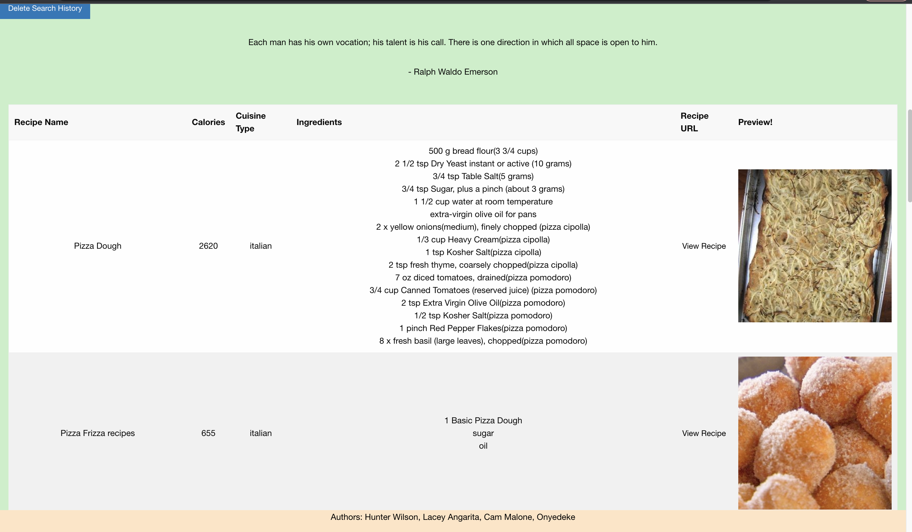

# Nutricipe
Recipe Generator based on selected food  

## Deployment Link 

https://laceya25.github.io/Nutricipe/

## Description

This app is our Recipe Generator Website. When you enter a food of your choice into the search bar, it brings up recipes, along with calorie intake and a delightful inspirational quote! 
Having to pick a new meal everyday can make it hard to come up with new things to try so this eliminates the guess work! Just type in any food you want, and a bunch of recipes will pop up for you to choose from that will include Calories, Cuisine Type, Ingredients and a preview of the delicious meal you will be consuming! 

On top of all this goodness, you will also receive a inspirational quote to brighten your day! 

## How to Use

When you are on the homepage, simply type the food you are looking to get recipes for into the search bar and you will recieve 
a inspirational quote followed by various recipes for your item. 

If you are looking for information about our website, push the "About" button in our nav bar to be brought to a section explaining
all about it! 

## Screenshot
 

## Technology Used 
Front End 

* HTML
* CSS
* JavaScipt
* API's

## API's Used 

* https://www.edamam.com/
* https://github.com/lukePeavey/quotable

## Our Team

* Hunter Wilson - HTML, APIs, JavaScript, Project Board
* Lacey Angarita - Repo, Project Board, CSS, HTML & README
* Cam Malone - Local Storage, JavaScript, Built recipe card table in HTML & built a function to display info from API
* Kingsley Onyedeke - Recipe Cards

